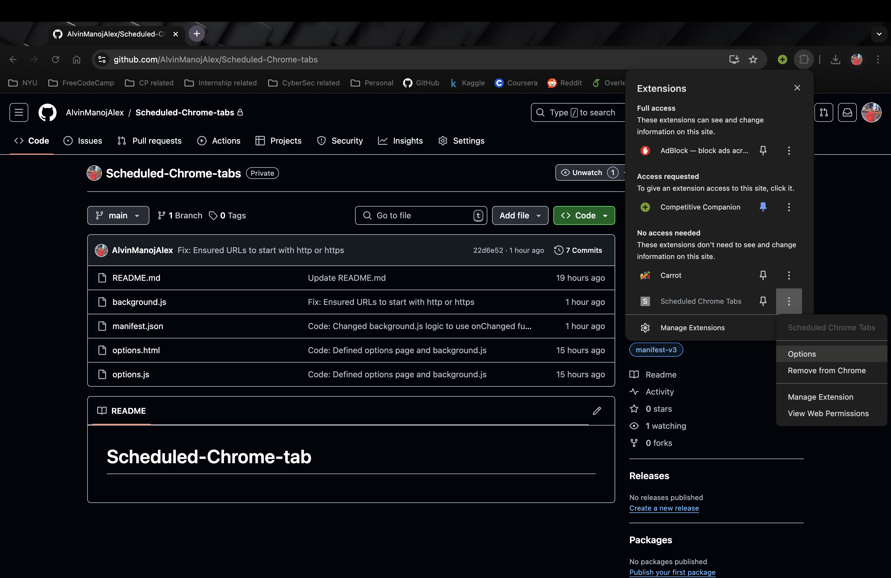
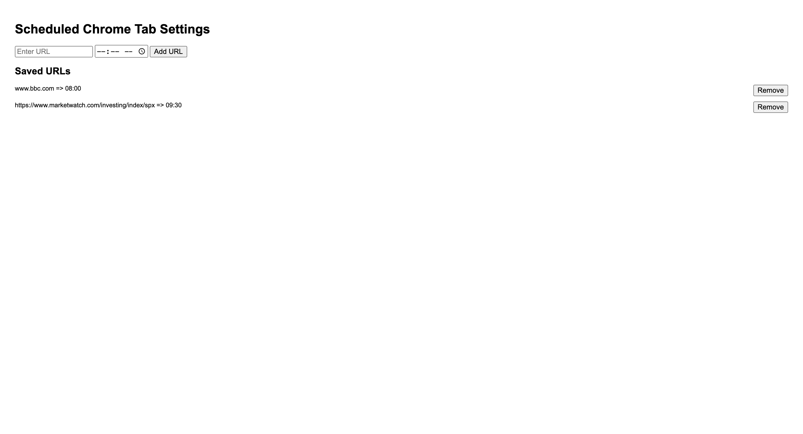

# Scheduled-Chrome-tabs

This is a chrome based extension, that is intended for users that never close their browser and want to schedule websites to open at a specific time of the day.

For example: Automatically open up [BBC news](www.bbc.com) at 8:00 AM ET and [S&P 500 Market Watch](https://www.marketwatch.com/investing/index/spx) at 9:30 AM ET.

## Technologies used

- Javascript

- Manifest V3

## Application

### Options page (to customize the URLs and the scheduled time)

## Running this repository

- Fork and then clone this repository using `git clone https://github.com/{YourUserName}/Scheduled-Chrome-tabs.git`.

- Open your chrome browser and go to `chrome://extensions`

- Toggle on the developer mode and click `Load Unpacked` and choose the repository.

- Once the extension is enabled, click on the extensions icon at the top of the chrome bar and click on the three dots next to 'Scheduled Chrome Tabs' and click options.

- Enter the URL and the time at which you want the URL to be opened at and click add.